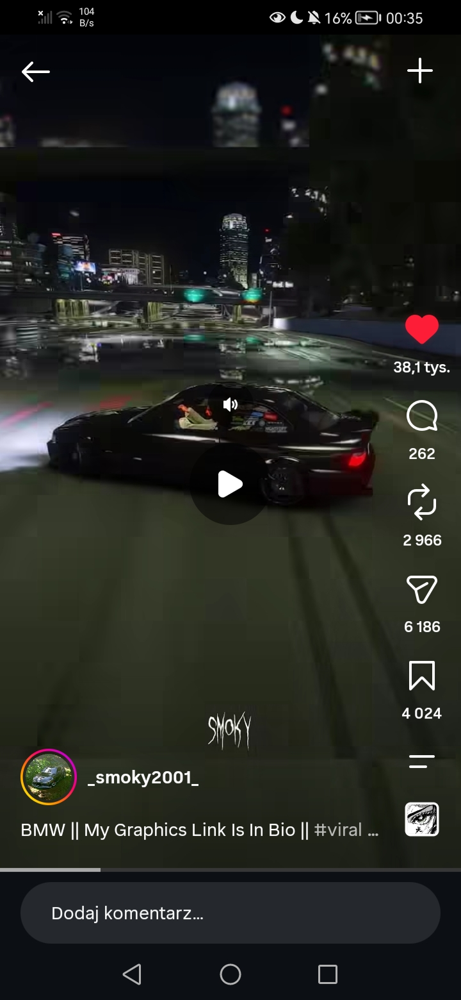

# RealisticCarNight 🌃🚗

Najbardziej realistyczna gra do chillowania sobie jeżdżąc po oświetlonym ogromnym mieście z nieziemską grafiką jakiej nie ma nawet GTA, a na dodatek to wszystko w przeglądarce!

Widok inspirowany załączonymi screenshotami: nocne downtown, mokry asfalt odbijający neony i wieżowce, estakady z turkusową łuną, czarne coupe ze świecącymi lampami i czerwonym paskiem tylnych świateł.



## 🎮 Jak uruchomić

```bash
npm install
npm run dev        # serwer deweloperski Vite (http://localhost:5173)
npm run build      # build produkcyjny do dist/
npm run preview    # serwer builda produkcyjnego
```

Gra działa w każdej nowoczesnej przeglądarce (desktop + telefon). Nie wymaga żadnych zewnętrznych assetów — całe miasto, samochód, tekstury i dźwięk są generowane proceduralnie w kodzie.

## 🕹 Sterowanie

| Klawisz / gest | Akcja |
|---|---|
| `W` / `S` / strzałki | gaz / hamulec + wsteczny |
| `A` / `D` / strzałki | skręt |
| `SPACJA` | handbrake (drift) |
| `C` | kamera: pościgowa ↔ maska |
| `R` | reset na środek skrzyżowania |
| `M` | dźwięk wł./wył. |
| `Q` | cykl jakości: AUTO → NISKA → ŚREDNIA → WYSOKA → ULTRA → AUTO |
| `H` | pomoc |
| Telefon | przyciski dotykowe: skręt / gaz / hamulec / drift |

## ✨ Co jest w środku

- **Mokry asfalt z prawdziwymi odbiciami planarnymi** — lustro w kałużach (fresnel + maska kałuż + animowane mikro-fale), renderowane z odbitej kamery do bufora HDR; na słabszych urządzeniach automatycznie zastępowane tańszym połyskiem z mapy otoczenia.
- **Proceduralne miasto 7×7 bloków (~800 m)**: wieżowce z losowo zapalonymi oknami (instancing + per-instancyjne UV), downtown z najwyższymi wieżami, migające czerwone światła ostrzegawcze, anteny, place z drzewami.
- **Neonowe reklamy i ekrany** (atlas 4×4 proceduralnych reklam), szyldy sklepów przy ulicach, zielone światła na skrzyżowaniach.
- **Estakady**: zamknięta pętla + krzyżująca się trasa przelotowa z filarami, barierami i turkusową łuną — jak na referencji.
- **Oświetlenie**: latarnie sodowe z „kałużami światła" na jezdni, reflektory samochodu (spotlighty + wolumetryczne stożki + plama na asfalcie), księżyc z cieniami (PCF soft), hemisphere + IBL wypalony z miasta (PMREM) dla lakieru clearcoat.
- **Samochód**: proceduralne coupe (extrudowany profil nadwozia, tinted glass, spoiler, felgi ze szprychami), lakier clearcoat, świecąca deska rozdzielcza jak na screenach; fizyka arcade z poślizgiem bocznym i driftem na handbrake'u.
- **Ruch uliczny**: auta AI jeżdżące po siatce ulic i po estakadach, z zapalonymi lampami.
- **Pogoda i niebo**: gradientowe niebo z łuną miasta, gwiazdy, księżyc z halo, deszcz na poziomie ULTRA.
- **Post-processing**: bloom (neony!), ACES filmic tone mapping, winieta, aberracja chromatyczna, drobne ziarno filmu.
- **HUD**: prędkościomierz ze wskazówką i biegiem, minimapa z ruchem ulicznym, licznik FPS, wskaźnik aktualnego poziomu grafiki.
- **Dźwięk 100% proceduralny** (WebAudio): silnik z biegami, szum wiatru, pisk opon przy drifcie.

## 📱 Automatyczne dopasowanie grafiki (żeby nie przeciążyć słabszych telefonów)

Startowy poziom jakości jest dobierany z cech urządzenia (mobile / rdzenie / RAM), a w trakcie jazdy pętla adaptacyjna mierzy FPS i przełącza 4 poziomy z histerezą i cooldownem:

| Poziom | Pixel ratio | Cienie | Odbicia w kałużach | Bloom | Ruch uliczny | Deszcz |
|---|---|---|---|---|---|---|
| NISKA | 1.0 | – | – | mały | 5 aut | – |
| ŚREDNIA | 1.4 | – | – | średni | 9 aut | – |
| WYSOKA | 1.75 | ✅ 1024 | ✅ 512 px | duży | 14 aut | – |
| ULTRA | 2.0 | ✅ 2048 | ✅ 1024 px | pełny + MSAA 4× | 18 aut | ✅ |

Zmiany obejmują też: gęstość mgły (zasięg rysowania), rozdzielczość odbić planarnych, intensywność IBL, MSAA w composerze i dekale świateł. Klawisz **Q** wymusza poziom ręcznie (i wraca do AUTO).

## 🧱 Struktura

```
src/
  main.js                 # bootstrap, pętla gry, kamera, composer, adaptacyjna jakość
  core/QualityManager.js  # detekcja urządzenia + histereza FPS (4 tier-y)
  core/Input.js           # klawiatura + przyciski dotykowe
  core/AudioEngine.js     # proceduralny dźwięk silnika/wiatru/opon
  core/utils.js           # RNG, proceduralne tekstury (okna, neony, asfalt, kałuże)
  world/City.js           # miasto: drogi, budynki, latarnie, neony, estakady, deszcz, kolizje
  world/PlanarReflection.js # odbicia planarne (mokry asfalt)
  world/Car.js            # model + fizyka samochodu gracza
  world/Traffic.js        # auta AI
  ui/HUD.js               # prędkościomierz, minimapa, toasty
```

## 📝 Notatki techniczne

- Three.js r170 + Vite, czysty ES modules, zero zewnętrznych assetów.
- Wszystko co się da jest instancjonowane (`InstancedMesh`), żeby utrzymać niską liczbę draw-calls na telefonach.
- Cienie aktualizują się raz na klatkę (pass odbić ich nie re-renderuje).
- Deterministyczny seed RNG — miasto wygląda identycznie na każdym urządzeniu.
