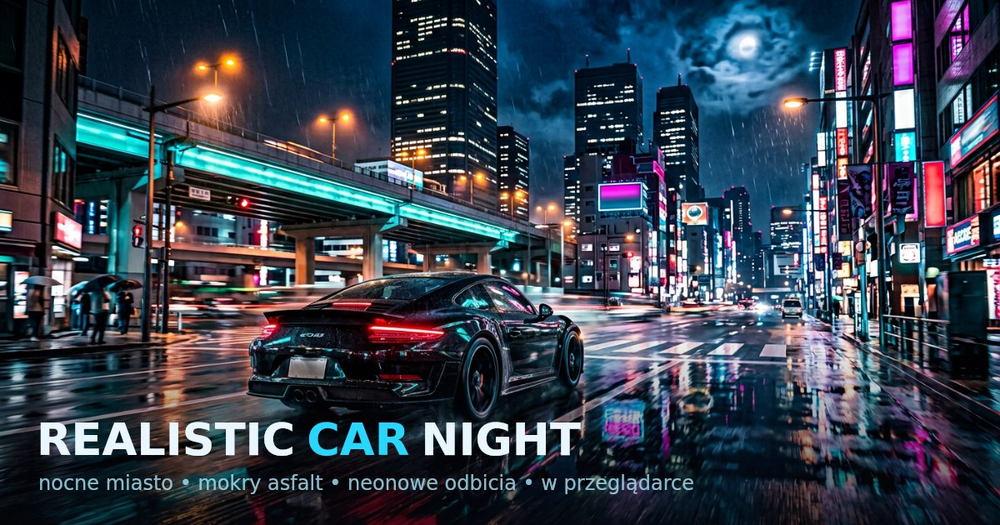

# Realistic Car Night 🌃

Najbardziej realistyczna gra do chillowania sobie jeżdżąc po oświetlonym ogromnym mieście z nieziemską grafiką jakiej nie ma nawet GTA, a na dodatek to wszystko w przeglądarce!

Widok inspirowany załączonymi screenshotami: nocne downtown, mokry asfalt odbijający neony i wieżowce, estakady z turkusową łuną, czarne coupe ze świecącymi lampami i czerwonym paskiem tylnych świateł.




## 🎮 Jak uruchomić

```bash
npm install
npm run dev        # serwer deweloperski Vite (http://localhost:5173)
npm run build      # build produkcyjny do dist/
npm run preview    # serwer builda produkcyjnego
npm test           # testy headless (miasto, fizyka, autopilot, AI, pierścienie, potok renderowania)
npm run test:glsl  # walidacja shaderów GLSL ES 3.00 (wymaga glslangValidator, inaczej pomija)
npm run lint       # eslint (src, testy, skrypty, service worker)
node scripts/make-assets.mjs   # regeneracja ikon PWA i og.jpg ze źródła design/
```

Gra działa w każdej nowoczesnej przeglądarce (desktop + telefon, da się ją też zainstalować jak aplikację — manifest PWA + service worker). Nie wymaga żadnych zewnętrznych assetów — całe miasto, samochód, tekstury, dźwięk **i muzyka w radiu** są generowane proceduralnie w kodzie.

## 🕹 Sterowanie

| Klawisz / gest | Akcja |
|---|---|
| `W` / `S` / strzałki | gaz / hamulec + wsteczny |
| `A` / `D` / strzałki | skręt |
| `SPACJA` | handbrake (drift + ślady opon + dym) |
| `C` | kamera: pościg → maska → zderzak → filmowa |
| `F` | tryb foto (orbita wokół auta: drag = obrót, kółko = zoom) |
| `P` | zapis zrzutu ekranu do PNG |
| `E` | klakson |
| `N` | następna stacja radia |
| `T` | autopilot — sam jeździ po mieście i **czeka na czerwonym** |
| `R` | reset na środek skrzyżowania |
| `M` | dźwięk wł./wył. |
| `Q` | cykl jakości: AUTO → NISKA → ŚREDNIA → WYSOKA → ULTRA → AUTO |
| `O` / `ESC` | ustawienia i garaż (lakier, neon, deszcz, głośności…) |
| `G` | panel wydajności (FPS, draw-calle, trójkąty, odbicia) |
| `H` | pomoc |
| Telefon | przyciski dotykowe: skręt / gaz / hamulec / drift + pasek ikon |

## ✨ Co jest w środku

### Miasto i pogoda
- **Mokry asfalt z prawdziwymi odbiciami planarnymi** — lustro w kałużach (fresnel + maska kałuż + animowane mikro-fale), renderowane z odbitej kamery do bufora HDR; na słabszych urządzeniach automatycznie niższa rozdzielczość/częstotliwość odświeżania lustra.
- **Proceduralne miasto 7×7 bloków (~800 m)**: wieżowce z losowo zapalonymi oknami (instancing + per-instancyjne UV liczone z pozycji świata), downtown z najwyższymi wieżami, migające czerwone światła ostrzegawcze, anteny, place z drzewami.
- **Neonowe reklamy i ekrany** (atlas 4×4 proceduralnych reklam), szyldy sklepów, sygnalizatory z pełnym cyklem zielone→żółte→czerwone (wspólny, deterministyczny model czasu świateł dla wizualizacji **i** dla AI).
- **Estakady**: zamknięta pętla + trasa przelotowa z filarami, barierami i turkusową łuną — jak na referencji.
- **Oświetlenie**: latarnie sodowe z „kałużami światła” na jezdni, reflektory auta (spotlighty + **wolumetryczne stożki** + plama na asfalcie), księżyc z cieniami (PCF soft), hemisphere + IBL wypalony z miasta (PMREM) dla lakieru clearcoat.
- **Deszcz** (krople + gęstsza mgła + mocniejsze odbicia + szum w audio) — domyślnie na ULTRA, wymuszany w ustawieniach.

### Samochód
- Proceduralne coupe: extrudowany profil nadwozia, tinted glass, spoiler, felgi ze szprychami, lakier clearcoat z dedykowaną mapą otoczenia „night city studio”, świecąca deska rozdzielcza jak na screenach.
- **Światła cofania**, światła stopu z point-lightem, klakson, dym i **trwałe, zanikające ślady opon** przy drifcie (jeden draw-call, instancje).
- **Neonowe podświetlenie podwozia** (7 kolorów) — świeci w mokrym asfalcie i w odbiciach.
- Fizyka arcade z poślizgiem bocznym, drift na handbrake’u i kolizjami z budynkami, filarami **oraz z ruchem ulicznym** (miękkie odepchnięcie + trzęsienie kamery + głuchy łomot).

### Ruch uliczny i autopilot
- Auta AI jeżdżą **prawostronnie**, zatrzymują się na czerwonym, trzymają odstęp (korki pod światłami), hamują światłami stopu i jeżdżą też po estakadach.
- **Autopilot** planuje trasę jako polyline po pasach (punkty wejścia/wyjścia na zakrętach zamiast ścinania krawężników), zwalnia przed zakrętem i przed stop-linią, nie zawraca poza sytuacją bez wyjścia, a gdy się zakleszczy — sam cofa i planuje od nowa. Seed RNG jest stały, więc ten sam przejazd jest powtarzalny (pilnuje tego test).

### Rozgrywka i „meta”
- **Neonowe pierścienie** nad pasami: przejazd = punkty, kolejne w krótkim odstępie podbijają mnożnik combo (do ×9); beacony i poświata w kałużach ułatwiają szukanie, minimapa je pokazuje.
- **Drift-score** liczony z poślizgu i prędkości, z dźwiękowymi progami.
- **Rekordy** (punkty, pierścienie, dystans, vmax, drift, czas) zapisywane w przeglądarce; po powrocie gra gratuluje pobitych rekordów.
- **Garaż / ustawienia** (`O`): lakier (9 kolorów + własny), neon podwozia, barwa reflektorów, poziom grafiki, deszcz, gęstość ruchu, siła odbić, FOV, głośności, stacja radia, obracana minimapa, podpowiedzi, panel wydajności — wszystko zapisywane w localStorage.
- **Tryb foto** (`F`): orbita wokół auta, mocniejszy bloom i winieta, zapis kadru do PNG (`P`).
- **Proceduralne radio** (`N`): cztery stacje syntezowane w WebAudio — *NEON DRIVE 88.4* (synthwave), *MIDNIGHT LO-FI 91.1*, *TURBO PHONK 104.7*, *AMBIENT NIGHT 107.9* — z delayem, padami, basem i bębnami; zero plików audio.
- **HUD**: prędkościomierz ze wskazówką i biegiem, minimapa (opcjonalnie obracana) z ruchem ulicznym i pierścieniami, licznik punktów z combo, pasek driftu, dystans i czas sesji, nazwa stacji, FPS i poziom grafiki.
- **Zaawansowany potok renderowania** (szczegóły: [`docs/RENDERING_PIPELINE.md`](docs/RENDERING_PIPELINE.md)):
  - **skalowanie czasowe (TAA/TAAU)** — scena rysowana w 0.7–0.85× rozdzielczości wewnętrznej z sub-pikselowym jitterem (rotowany Halton 2,3), składana z historią przez reprojection + **clip wariancji 3×3**, a na końcu ostrzona **CAS** — ta sama rodzina technik co DLSS/FSR: ~2× mniej pikseli do cieniowania bez utraty ostrości;
  - **pass wektorów ruchu** dla auta gracza i ruchu ulicznego (osobna warstwa, `overrideMaterial`) — bez ghostingu na poruszających się obiektach;
  - **ambient occlusion** liczony wyłącznie z bufora głębokości, w połowie rozdzielczości, z bilateralnym upsamplen — miękkie cienie kontaktowe pod autem i przy krawężnikach, **zero dodatkowych rysunków sceny**;
  - **subtelna głębia ostrości** (bokeh z CoC) — oddziela auto od neonów tła;
  - **ACES filmic tone mapping** na liniowym HDR (`HalfFloat`) + fizycznie poprawna poświata/glare (bloom przed tonemapem);
  - **gradacja LUT 3D 32³** generowana proceduralnie (float, bez bandingu): profile *Naturalny* (fotograficzny: krzywa S, split-toning, desaturacja, toe/shoulder), *Filmowy* (teal & orange), *Neonowy* i *bez gradacji*;
  - wykończenie obiektywu: aberracja chromatyczna, radialny blur prędkości, winieta, ziarno filmu;
  - **IBL z PMREM** (wypalany raz) + **cienie PCF Soft** (opcjonalnie VSM) z cache’owaną mapą cieni.

## 📱 Automatyczne dopasowanie grafiki (żeby nie przeciążyć słabszych telefonów)

Startowy poziom jakości jest dobierany z cech urządzenia (mobile / rdzenie / RAM), a w trakcie jazdy pętla adaptacyjna mierzy FPS i przełącza 4 poziomy z histerezą i cooldownem (przy bardzo słabych GPU dodatkowo skaluje rozdzielczość):

| Poziom | Pixel ratio | Cienie | Odbicia w kałużach | MSAA | Bloom | Ruch uliczny | Deszcz |
|---|---|---|---|---|---|---|---|
| NISKA | 0.8 | – | 192 px co 4 kl. | – | mały | 4 auta | – |
| ŚREDNIA | 1.2 | – | 320 px co 2 kl. | – | średni | 7 aut | – |
| WYSOKA | 1.6 | ✅ 1024 | 512 px co 2 kl. | 4× | duży | 12 aut | – |
| ULTRA | 2.0 | ✅ 2048 | 1024 px co 1 kl. | 4× | pełny | 16 aut | ✅ |

Potok renderowania ma własną tabelę budżetu (`PIPE_PROFILES`) — decyduje, ile pikseli naprawdę się rysuje:

| Tier | Rozdzielczość wewnętrzna | Skalowanie czasowe | Wektory ruchu | AO | DOF | MSAA (gdy TAA wył.) |
|---|---|---|---|---|---|---|
| NISKA / ŚREDNIA | 1.00× | – | – | – | – | – / – |
| WYSOKA | 0.85× | ✅ | – | ✅ | – | 4× |
| ULTRA | 0.70× | ✅ | ✅ | ✅ | ✅ | 4× |

Zasada: **albo TAA, albo MSAA** (jitter już pokrywa krawędzie), a wyłączenie skalowania czasowego
w menu automatycznie wraca do natywnej rozdzielczości z MSAA — obraz nigdy nie jest jednocześnie
miękki i postrzępiony. Tryb foto zawsze renderuje w pełnej rozdzielczości wewnętrznej.

Do tego mnożniki z ustawień: gęstość ruchu (0–2×) i rozdzielczość odbić (0.5–2×). Klawisz **Q** wymusza poziom ręcznie (i wraca do AUTO), a w menu można to kliknąć.

## 🧱 Struktura

```
src/
  main.js                 # bootstrap, pętla gry, ustawienia, pauza, zrzuty PNG
  core/Settings.js        # persistowane ustawienia + rekordy (localStorage)
  core/QualityManager.js  # detekcja urządzenia + histereza FPS (4 tier-y)
  core/Input.js           # klawiatura + przyciski dotykowe
  core/AudioEngine.js     # silnik/wiatr/opony/deszcz/klakson/uderzenia + magistrale głośności
  core/Radio.js           # 4 proceduralne stacje (scheduler taktów, delay, bębny, bas, pady)
  core/Autopilot.js       # pure-pursuit po zaplanowanej trasie, światła, odkleszczanie
  core/utils.js           # RNG, proceduralne tekstury (okna, neony, asfalt, kałuże, poświaty)
  world/City.js           # drogi, budynki, latarnie, neony, estakady, deszcz, kolizje, światła
  world/PlanarReflection.js # odbicia planarne (mokry asfalt)
  world/Car.js            # model + fizyka auta gracza, stożki świateł, ślady opon, podświetlenie
  world/Traffic.js        # auta AI: prawostronnie, światła, odstępy, światła stopu
  world/Collectibles.js   # neonowe pierścienie, combo, drift-score
  render/Pipeline.js      # orkiestracja potoku: profile, RT, jitter, historia, begin/render/endFrame
  render/pipeline/jitter.js         # rotowany Halton(2,3) 16 próbek, apply/clearJitter
  render/pipeline/lut.js            # proceduralne LUT-y 3D 32³ (natural / film / vivid / none)
  render/pipeline/TemporalPasses.js # VelocityPass (wektory ruchu) + TemporalResolvePass (TAA/TAAU)
  render/pipeline/ImagePasses.js    # AO z deptha (½ res), bokeh DOF, PresentPass (CAS+LUT+CA+ziarno)
  render/CameraRig.js     # 4 kamery + orbita trybu foto
  ui/HUD.js               # prędkościomierz, minimapa, punkty, trip, perf, toasty
  ui/Menu.js              # panel ustawień / garaż (4 zakładki)
scripts/make-assets.mjs   # ikony PWA + og.jpg ze źródła design/og-src.png
public/                   # manifest, service worker, favicon, ikony, og.jpg
test/headless.mjs         # testy bez WebGL: miasto, fizyka, AI, światła, pierścienie, potok renderowania
test/shaders.mjs          # walidacja shaderów GLSL ES 3.00 (glslangValidator: kompilacja + link + uniformy)
docs/RENDERING_PIPELINE.md# architektura potoku, budżet FPS i weryfikacja shaderów
```

## 📝 Notatki techniczne

- Three.js r170 + Vite, czysty ES modules, zero zewnętrznych assetów (także audio — wszystko syntezuje WebAudio).
- Wszystko co się da jest instancjonowane (`InstancedMesh`), żeby utrzymać niską liczbę draw-calls na telefonach; ślady opon, pierścienie i beacony to po jednym draw-callu na warstwę.
- Cienie aktualizują się raz na klatkę (pass odbić ich nie re-renderuje), a lustro kałuż ma konfigurowalny interwał odświeżania.
- Passy fullscreen mają wyłączony `autoClear` (inaczej czyściłyby `DepthTexture`, z którego korzystają AO i DOF), a głębokość sceny jest przekazywana jawnie z `renderTarget1`, bo kompozytor ping-ponguje buforami.
- Shadery potoku są walidowane offline (`npm run test:glsl`: `glslangValidator` z prefiksem Three.js dla WebGL2 — kompilacja, **link** vertex+fragment oraz cross-check uniformów GLSL ↔ JS), więc literówka w uniformie nie przechodzi jako cichy `0`.
- LUT gradacji jest wypalany jako **RGB16F** (half-float): 8 bitów bandinguje w nocnych gradientach, a float32 wymaga `OES_texture_float_linear`, którego nie ma część mobilnych GPU.
- Deterministyczny seed RNG — miasto, ruch i przejazd autopilota wyglądają identycznie na każdym urządzeniu; test porównuje dwa przejazdy co do centymetra.
- Service worker jest rejestrowany tylko w buildzie produkcyjnym (hashowane assety cache-first, nawigacja network-first), więc dev-server nie łapie się w cache.
- Ustawienia i rekordy żyją w `localStorage` (`rcn.settings.v1`, `rcn.records.v1`) — bez konta, bez sieci.
